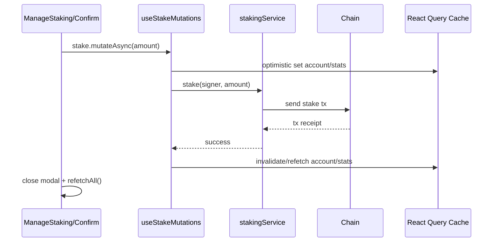
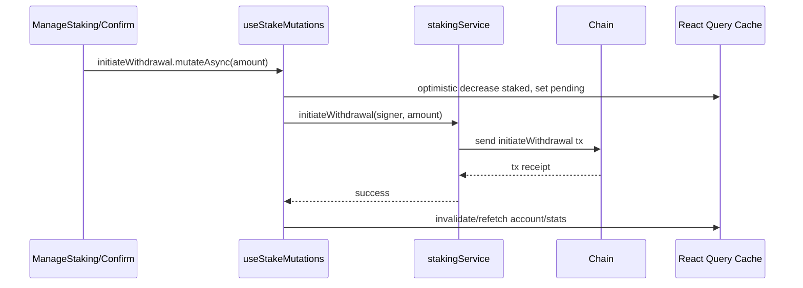

# Current KITE Staking – System Map

This document inventories the current staking implementation end-to-end, grouping files by responsibility, and outlines the primary data/transaction flows and where KITE staking affects boost-related UI and APR.

## Inventory by responsibility

### UI pages and sections
- `src/containers/Stake/index.tsx`: Page shell; nav between Manage and Activity; wires a local simulation state into child sections.
- `src/containers/Stake/Manage/Overview.tsx`: High-level stats (total staked, my staked, share, base APR, boost). Uses `useStakingSummaryV2` and displays KITE-specific labels.
- `src/containers/Stake/Manage/ManageStaking.tsx`: Inputs for Stake/Unstake; manages review/withdraw modals; reads account/stats via react-query hooks and legacy provider fallback; triggers write mutations.
- `src/containers/Stake/Activity.tsx`: Displays staking activity via `useStakingData` (legacy provider path) and table.

### Modals
- `src/components/Modal/StakingTxModal/index.tsx`: Two-step modal (approve → confirm); supports withdraw-only flow.
- `src/components/Modal/StakingTxModal/Confirm.tsx`: Executes stake/initiateWithdrawal/withdraw; sets waiting payloads; contains KITE-specific copy and shows Net Boost simulation.
- `src/components/Modal/StakingClaimModal.tsx`: Aggregates and displays claimable rewards; claims via rewards service; uses KITE/HAI/OP addresses and price mapping.

### Hooks – React Query (V2 path)
- `src/hooks/staking/useStakeAccount.ts`: On-chain reads for user account (stakedBalance, pendingWithdrawal [null for now], rewards aggregation, cooldown).
- `src/hooks/staking/useStakeStats.ts`: On-chain total staked.
- `src/hooks/staking/useStakeMutations.ts`: Centralized write ops with optimistic updates for stake/initiateWithdrawal/withdraw/cancel/claimRewards and cache invalidation. Query keys: `['stake','account',address]`, `['stake','stats']`.
- `src/hooks/staking/useStakingSummaryV2.ts`: Derives composite summary (prices, effective balance, share, base APR, boost, simulation) from the V2 hooks and `useBoost`.

### Legacy provider/model path (still in use by some surfaces)
- `src/providers/StakingProvider.tsx`: Apollo subgraph queries for `stakingUser`, `stakingStatistic(id: "singleton")`; merges with store; exposes `stakingData`, `stakingStats`, rewards, cooldown, and `refetchAll`.
- `src/model/stakingModel.ts`: Easy-peasy model with optimistic state and thunks for stake/unstake/withdraw/cancel/getReward; initial data fetches (cooldown, rewards, APY, totals, balances); uses `VITE_STAKING_MANAGER` and ABIs.

### Services and config
- `src/services/stakingService.ts`: On-chain reads/writes for staking manager (totalStaked, stakedBalances, cooldown, rewards, and write transactions).
- `src/config/contracts.ts`: Centralizes addresses/ABIs and token metadata via env (`VITE_STAKING_MANAGER`, `VITE_KITE_ADDRESS`, `VITE_STAKING_TOKEN_ADDRESS`, etc.).

### Rewards and boost integration
- `src/hooks/useBoost.tsx`: Computes net boost and its components from KITE staking share, haiVELO positions, and vault positions; consumes `useStakeAccount`/`useStakeStats` and other providers.
- `src/services/boostService.ts`: Stateless boost calculators (LP, haiVELO, vault, combination, simulation, base APR).
- `src/services/rewards/incentivesDistributorService.ts`: Claims and epoch/timer logic for distributor (Merkle-based); used to power claim surfaces.

### Other notable surfaces
- `src/containers/Stake/Stats.tsx` (if present in legacy path): Displays stake stats and reward tokens; connects to prices and staking summary.

## Notable KITE-specific coupling (useful seams for abstraction)

- User-facing copy and labels reference KITE and stKITE throughout page and modal UI.
- Boost-related UI is shown in Overview and Confirm modal assuming KITE staking affects boost.
- Query cache keys are unscoped (no pool/namespace) and shared across staking.
- Subgraph IDs assume a singleton stats entity and user entity keyed by user address.

Code references (examples):

```46:52:src/components/Modal/StakingTxModal/Confirm.tsx
popupsActions.setWaitingPayload({
    title: 'Waiting For Confirmation',
    text: isStaking ? 'Stake KITE' : isWithdraw ? 'Withdraw KITE' : 'Unstake KITE',
    hint: 'Confirm this transaction in your wallet',
    status: ActionState.LOADING,
})
```

```53:56:src/hooks/staking/useStakeMutations.ts
const accountKey = ['stake', 'account', address?.toLowerCase() || '0x0']
const statsKey = ['stake', 'stats']
```

```12:41:src/providers/StakingProvider.tsx
const STAKING_USER_QUERY = gql`
  query GetStakingUser($id: ID!) { stakingUser(id: $id) { ... } }
`
const STAKING_STATS_QUERY = gql`
  query GetStakingStats { stakingStatistic(id: "singleton") { ... } }
`
```

```15:41:src/config/contracts.ts
export const contracts = Object.freeze({
  stakingManager: { address: requireEnv('VITE_STAKING_MANAGER'), abi: StakingManagerABI },
  tokens: { kite: requireEnv('VITE_KITE_ADDRESS'), stKite: requireEnv('VITE_STAKING_TOKEN_ADDRESS'), ... },
})
```

## End-to-end flows

### Stake (deposit)
1) UI: `ManageStaking` opens `StakingTxModal` → `Confirm` with `isStaking=true` and `amount`.
2) Confirm: sets waiting payload, calls `useStakeMutations().stake.mutateAsync(amount)`.
3) Mutation: optimistic update of `['stake','account',address]` and `['stake','stats']`; sends tx via `services/stakingService.stake(signer, amount)`.
4) On success: invalidates and refetches queries; wallet balances refresh; modal closes and `refetchAll` (legacy provider) runs.
5) Store path (legacy flows): `stakingModel.stake` exists but V2 path relies on react-query + services; model still drives initial data and rewards/apy.

### Initiate Withdrawal (request unstake)
1) UI: `ManageStaking` with `unstakingAmount>0` opens `StakingTxModal` → `Confirm` with `isStaking=false` and `isWithdraw=false`.
2) Confirm: calls `useStakeMutations().initiateWithdrawal.mutateAsync(amount)`.
3) Mutation: optimistic reduce `stakedBalance` and set `pendingWithdrawal`; tx via `stakingService.initiateWithdrawal`.
4) Success: invalidate/refetch queries; legacy `refetchAll` called by modal.

### Withdraw (claim after cooldown)
1) UI: `ManageStaking` detects pending withdrawal available and opens `StakingTxModal` with `isWithdraw=true`.
2) Confirm: calls `useStakeMutations().withdraw.mutateAsync()`; optimistic clear of `pendingWithdrawal`.
3) Tx via `stakingService.withdraw` → invalidate/refetch.

### Cancel Withdrawal
1) UI: `ManageStaking` shows Cancel when cooldown not elapsed; calls `useStakeMutations().cancelWithdrawal.mutateAsync()`.
2) Optimistic: move pending amount back to `stakedBalance` and clear `pendingWithdrawal`; tx via `stakingService.cancelWithdrawal`.

### Claim Rewards
1) UI: `StakingClaimModal` aggregates rewards (legacy store path) and calls `services/rewards/stakingRewardsService.claimRewards` or modern injector (incentives distributor) depending on surface; `useStakeMutations().claimRewards` also supports optimistic clear.
2) After claim: refetch via provider/store; cache invalidation in react-query variant.

### Sequence diagrams (key flows)

Stake



Initiate Withdrawal



## Boost touchpoints (reads and UI surfaces)

Inputs and computations:
- KITE stake share: `useStakeAccount().stakedBalance`, `useStakeStats().totalStaked` used in `useBoost` to compute haiVELO and vault boosts.
- LP and positions: `useVelodromePositions`, LP hooks (pool, user liquidity/value), haiVELO mapping, collateral/minter data; combined in `useBoost` and `services/boostService`.

Surfaces where boost is shown/used:
- Overview: `Overview.tsx` shows My Boosted Value and My Net Boost (from `useStakingSummaryV2` which consumes `useBoost`).
- Confirm modal: `Confirm.tsx` shows Net Boost current/after values (uses `useBoost.simulateNetBoost`).
- APR derivation: `useStakingSummary` (legacy) computes base APR using rewards and totals; `useBoost.calculateBaseAPR` available for derived displays.

Notes:
- Today, boost assumes KITE staking is the source of “staking share”. LP-token staking variants must set `affectsBoost=false` to suppress these surfaces in the future abstraction.


